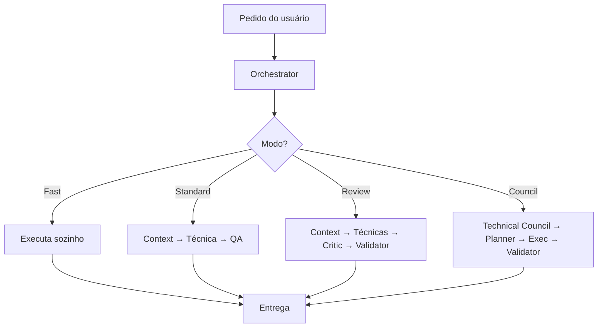

# Modos de Operação

> Finalidade: o Orchestrator escolhe **um** modo por tarefa para balancear qualidade e consumo de tokens.

## Visão geral



## MODE 1 — Fast

**Usar para:** perguntas, dúvidas, documentação simples, pequenas alterações (1 arquivo, sem risco).

```
Orchestrator → Executa sozinho → Entrega
```

- Nenhuma outra skill é chamada
- Resposta direta e concisa
- Working Context mínimo ou ausente

**Sinais:** "o que é", "como funciona", "explique", typo, comentário, doc de 1 parágrafo

## MODE 2 — Standard

**Usar para:** bugs pequenos, melhorias pontuais, features pequenas (1–2 módulos, baixo risco).

```
Orchestrator → Context Builder → Skill Técnica → QA → Entrega
```

- Context Builder só se contexto insuficiente
- Uma skill técnica principal (backend, api, react, etc.)
- QA valida fix/feature mínima
- Sem Critic salvo regressão óbvia

**Sinais:** bug isolado, ajuste de UI, endpoint simples, teste faltando

## MODE 3 — Review

**Usar para:** alteração estrutural, banco, autenticação, pagamentos, integrações, performance.

```
Orchestrator → Context Builder → Skills Técnicas → Critic → Validator → Entrega
```

- Múltiplas skills técnicas se necessário
- Critic obrigatório antes de considerar pronto
- Validator obrigatório (testes, lint, build quando aplicável)
- Risk Reviewer se auth/dados sensíveis

**Sinais:** migration, OAuth, webhook, query lenta, mudança de contrato API

## MODE 4 — Technical Council

**Usar para:** risco elevado, múltiplos módulos (>3), mudanças arquiteturais, refatorações grandes, incidentes críticos, produção, decisão técnica importante.

```
Orchestrator → Technical Council → Decision Maker → Implementation Planner
    → Execução (skills técnicas) → Validator → Entrega
```

- Conselho montado sob demanda — ver `technical-council.md`
- Decision Maker resolve conflitos (nunca fala com usuário)
- Usuário vê **somente decisão consolidada**

**Sinais:** "refatorar módulo inteiro", incidente produção, nova arquitetura, pagamentos, >3 módulos

## Matriz de decisão rápida

| Fator | Fast | Standard | Review | Council |
|-------|------|----------|--------|---------|
| Arquivos afetados | 0–1 | 1–3 | 2–5 | >3 ou arquitetura |
| Risco | Muito baixo | Baixo | Médio | Alto/Crítico |
| Módulos | 1 | 1–2 | 2–3 | >3 |
| Produção | Não | Não | Possível | Sim/incidente |
| Auth/DB/Pagamento | Não | Não | Sim | Sim + conselho |

## Escalonamento

O Orchestrator pode **subir** de modo durante a execução se descobrir maior complexidade:

```
Fast → Standard → Review → Technical Council
```

Nunca **descer** de modo sem reavaliar risco.

## Mapeamento workflow → modo sugerido

| Workflow | Modo padrão | Escala para Council se |
|----------|-------------|------------------------|
| bug | Standard | produção, >3 módulos |
| feature | Standard/Review | auth, pagamento, arquitetura |
| incident | Council | sempre (produção) |
| refactor | Review/Council | grande escopo |
| review | Fast/Standard | N/A |
| documentation | Fast | N/A |
| security | Review/Council | sempre Council se auth |
| architecture | Council | sempre |
| database | Review/Council | migration em produção |
